# Hey, I’m Erik 👋

A Swedish dabbler in all sorts, master of none. I’ve fallen deep down the Omarchy rabbit hole ever since the day I first installed it (438 days ago) and I’m having far too much fun. I make themes and mostly silly plugins for my own Omarchy desktop, then share them in case someone else enjoys them too.

## 🧩 Plugins & desktop toys

- [Theme Favorites](https://github.com/ejuro/omarchy-theme-favorites) — find out which Omarchy themes you actually use most, then export your top five to show off your taste.
- [Blow Off Some Steam](https://github.com/ejuro/blow-off-some-steam) — a fun game for when you’re bored, angry or just waiting for your agents to finish.
- [Omi the Cat](https://github.com/ejuro/omi-the-cat) — a tiny desktop pet that feeds on your spent tokens.
- [Phosphor CRT](https://github.com/ejuro/phosphor-crt-overlay) — a retro CRT overlay.
- [OmaMap](https://github.com/ejuro/omamap) — track the countries you’ve visited.

## 🎨 Themes

Click a preview to explore the theme.

<table>
  <tr>
    <td align="center" width="50%"><a href="https://github.com/ejuro/omarchy-cool-dawn-theme">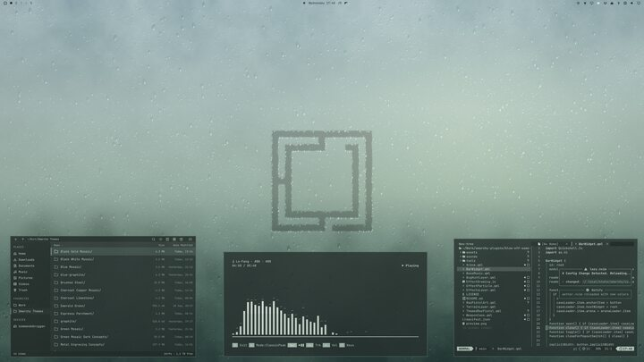 <strong>Cool Dawn</strong></a></td>
    <td align="center" width="50%"><a href="https://github.com/ejuro/omarchy-misty-sunset-theme">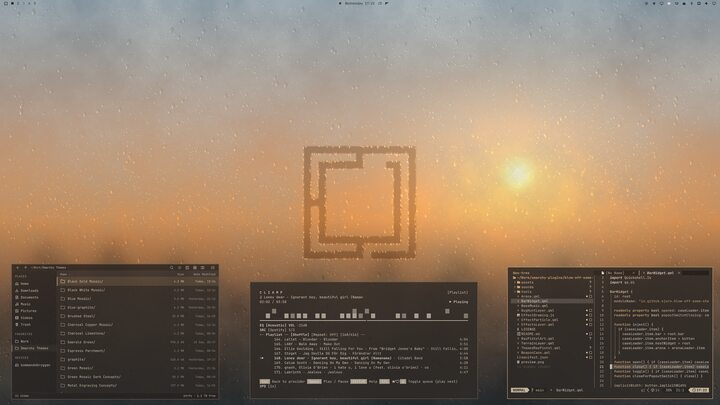 <strong>Misty Sunset</strong></a></td>
  </tr>
  <tr>
    <td align="center" width="50%"><a href="https://github.com/ejuro/omarchy-blue-hour-theme">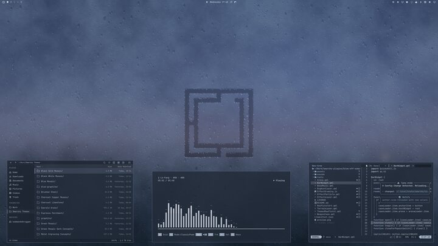 <strong>Blue Hour</strong></a></td>
    <td align="center" width="50%"><a href="https://github.com/ejuro/omarchy-neon-glow-theme"> <strong>Neon Glow</strong></a></td>
  </tr>
  <tr>
    <td align="center" width="50%"><a href="https://github.com/ejuro/omarchy-pine-ivory-mosaic-theme">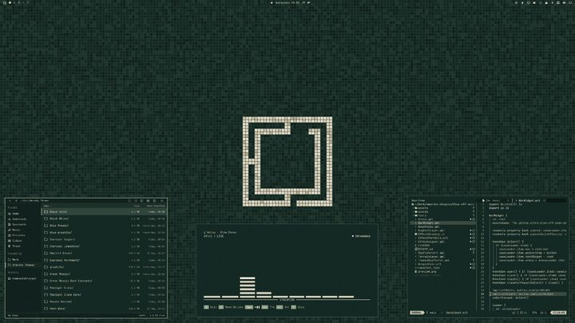 <strong>Pine Ivory Mosaic</strong></a></td>
    <td align="center" width="50%"><a href="https://github.com/ejuro/omarchy-black-gold-mosaic-theme">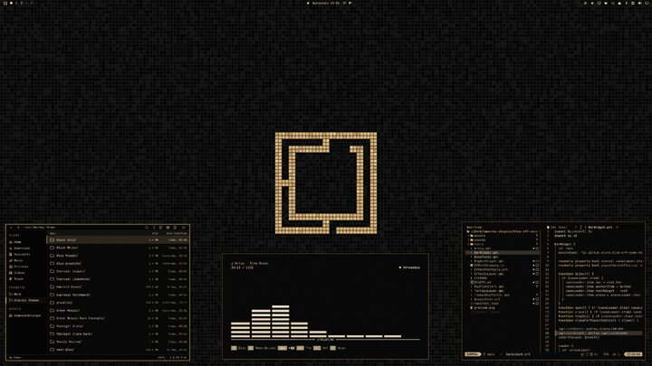 <strong>Black Gold Mosaic</strong></a></td>
  </tr>
  <tr>
    <td align="center" width="50%"><a href="https://github.com/ejuro/omarchy-petrol-champagne-mosaic-theme">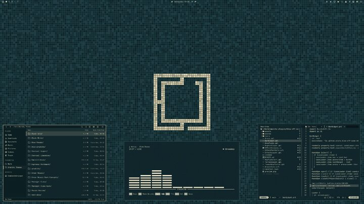 <strong>Petrol Champagne Mosaic</strong></a></td>
    <td align="center" width="50%"><a href="https://github.com/ejuro/omarchy-charcoal-copper-mosaic-theme">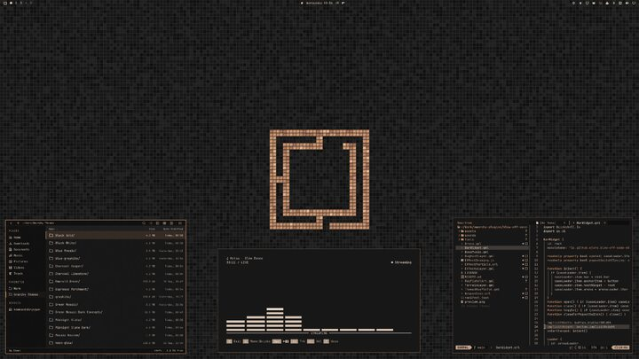 <strong>Charcoal Copper Mosaic</strong></a></td>
  </tr>
  <tr>
    <td align="center" width="50%"><a href="https://github.com/ejuro/omarchy-blue-mosaic-theme">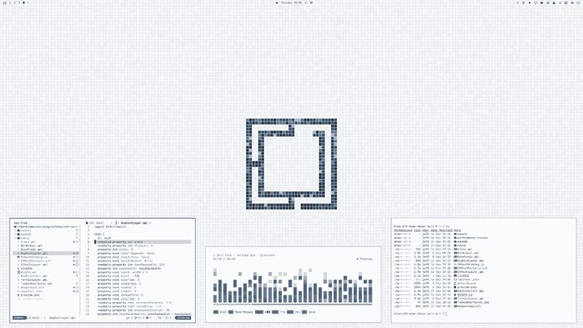 <strong>Blue Mosaic</strong></a></td>
    <td align="center" width="50%"><a href="https://github.com/ejuro/omarchy-green-mosaic-theme">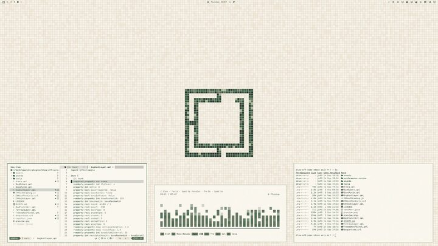 <strong>Green Mosaic</strong></a></td>
  </tr>
  <tr>
    <td align="center" width="50%"><a href="https://github.com/ejuro/omarchy-midnight-slate-dark-mosaic-theme">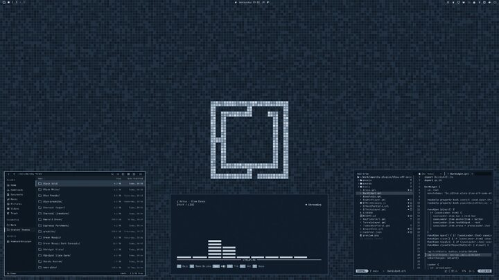 <strong>Midnight Slate Dark Mosaic</strong></a></td>
    <td align="center" width="50%"><a href="https://github.com/ejuro/omarchy-black-white-mosaic-theme">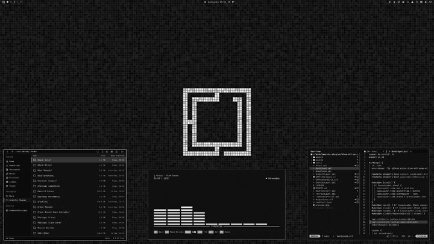 <strong>Black White Mosaic</strong></a></td>
  </tr>
  <tr>
    <td align="center" width="50%"><a href="https://github.com/ejuro/oligarchy-theme">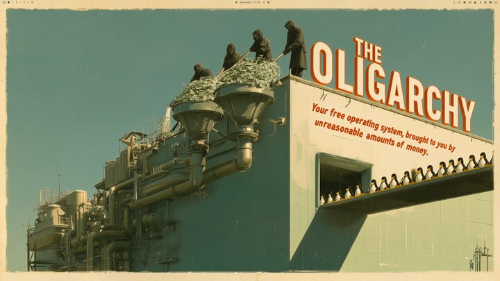 <strong>Oligarchy</strong></a></td>
  </tr>
</table>

## 📱 Wallpapers

[Omarchy Neon Glow for mobile](https://github.com/ejuro/omarchy-glow-mobile).
